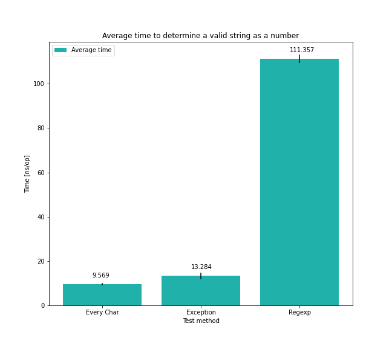
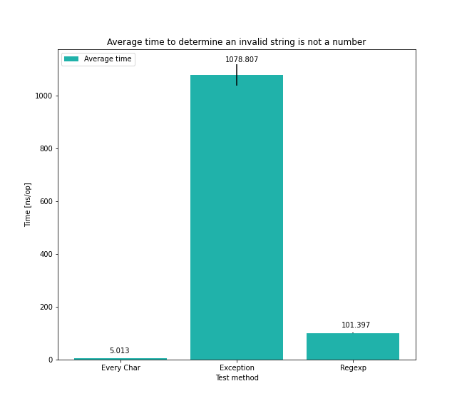
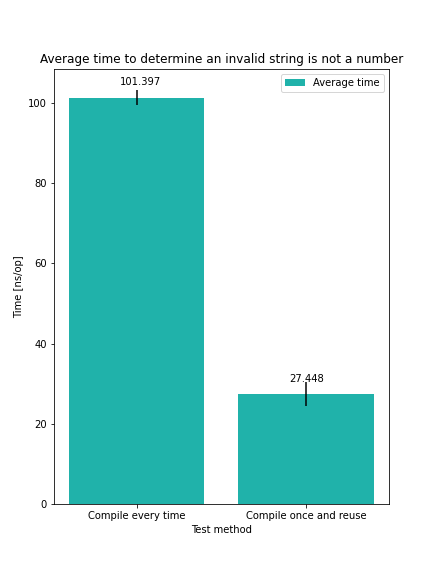

# Использование jmh

Необходимо провести тестирование трех методов проверки на то, что строка является числом:

- `Integer.parseInt(...)` с выбрасыванием исключения `NumberFormatException`
- Проверка каждого символа строки при помощи `Character.isDigit(...)`
- При помощи регулярного выражения `^\d+$`

Суммарно мною было реализовано шесть тестов - проверка валидной и невалидной строк каждым из трех методов.

Параметры JMH и окружение, с которыми проводилось тестирование:
```
# JMH version: 1.30
# VM version: JDK 11.0.11, OpenJDK 64-Bit Server VM, 11.0.11+9
# VM options: -Dfile.encoding=UTF-8 -Duser.country=RU -Duser.language=en -Duser.variant
# Blackhole mode: full + dont-inline hint
# Warmup: 3 iterations, 5 s each
# Measurement: 3 iterations, 10 s each
# Timeout: 10 min per iteration
# Threads: 1 thread, will synchronize iterations
# Benchmark mode: Average time, time/op
# CPU: Apple M1
# OS: MacOS 11.3.1 (20E241)
```

### Результаты

*Проверка валидной строки* `"298374239"`


Видно, что самым быстрым вариантом является проверка каждого символа строки, далее с небольшим отставанием идет вариант с исключением, последнее место занимает регулярное выражение.

Стоит отметить, что небольшое отставание варианта с исключением от проверки каждого символа можно обусловить тем, что в методе `Integer.parseInt(...)` происходит непосредственно конвертация строки в число, тогда как в варианте с проверкой каждого символа устанавливается только сам факт - является ли строка числом.

---

*Проверка невалидной строки* `"not a number"`


Если на вход поступает строка, которая не является числом, то ситуация с исключением в корне меняется. Наблюдается значительное ухудшение производительности из-за сбора стэктрейса (stack trace construction) во время создания экземпляра исключения и пробрасывания исключения (stack unwinding).

Проверка каждого символа отработала быстрее по сравнению с валидной строкой, так как строку можно не считать числом при встрече первого символа, который не является цифрой => целиком всю строку проверять не нужно.

---

Отдельно стоит отметить вариант с регулярными выражениями. Регулярные выражения в Java компилируются во внутреннюю структуру данных. Эта компиляция - трудоемкий процесс. Каждый раз, когда при вызове метода `String.matches(String regex)`, указанное регулярное выражение компилируется снова. (Все вышеперечисленные результаты получены с использованием такого подхода).

Поэтому, одним из вариантов ускорения регулярных выражений может являться переиспользование скомпилированного паттерна. Это наглядно демонстрирует график ниже:



### Выводы

- Самым быстрым вариантом является проверка каждого символа строки
- Бросание исключений - дорого
- Нужно стремиться к переиспользованию скомпилированного паттерна в регулярных выражениях